# AI Commerce Operations

這是一台自動生成電商網站的機器：輸入品類與品牌定位，輸出一個可部署的完整店面。
**生產線的意思是**：做一個站的每一步都寫成固定流程，每開一個新站就照同一套步驟跑一次，不重新發明做法。撐起這條生產線的，是圍繞它的 13 個部門。

**目前 35 個站在線上運作（2026-08-05 逐一 HTTP 實測皆可開啟）。單站產出時間 29 分鐘。**

<table>
<tr>
<td width="33%" valign="top">
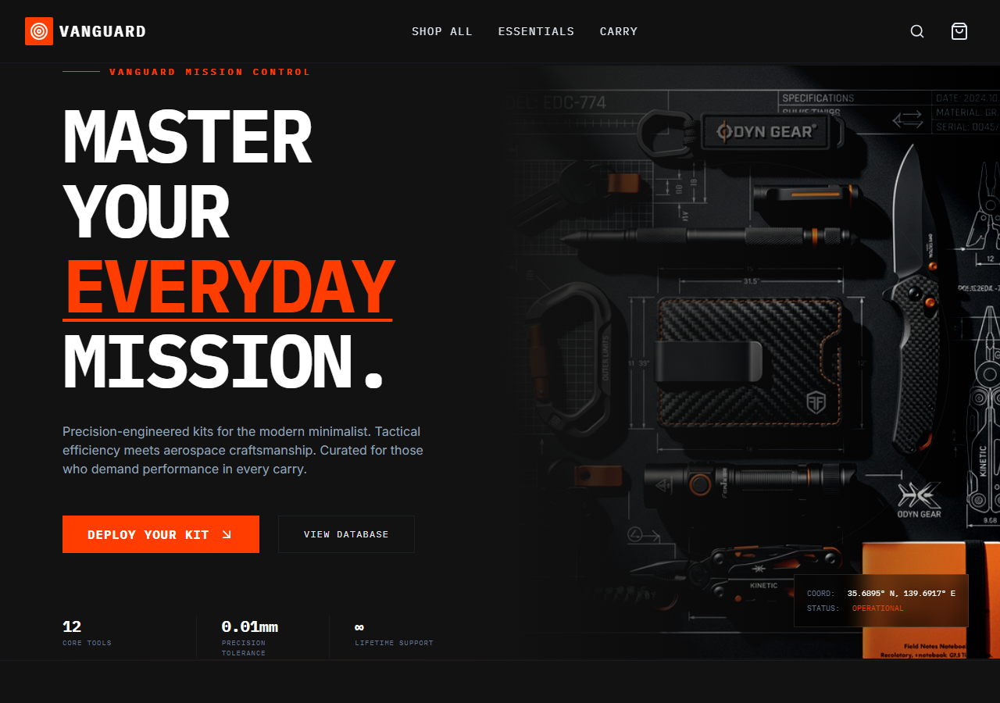
</td>
<td width="33%" valign="top">

</td>
<td width="33%" valign="top">
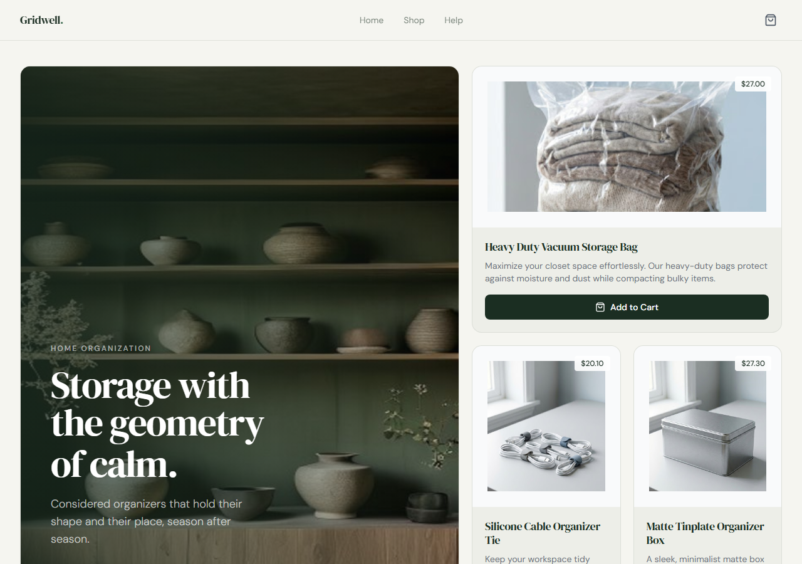
</td>
</tr>
<tr>
<td align="center"><sub><b>Vanguard</b>｜EDC 隨身工具</sub></td>
<td align="center"><sub><b>Auraguard</b>｜開運與風水飾品</sub></td>
<td align="center"><sub><b>Gridwell</b>｜居家收納用品</sub></td>
</tr>
</table>

> 原始碼與更多截圖在 [`examples/`](examples/)。

---

## 一個站是怎麼做出來的

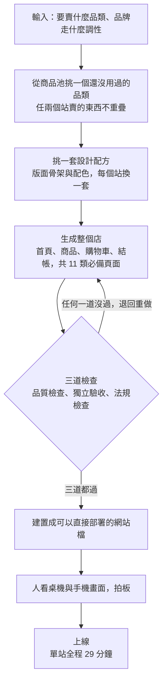

三道檢查任何一道沒過都退回重做，沒有「差不多就放行」這個選項。
每一步在做什麼、三道檢查怎麼串起來，見 [`docs/how-it-works.md`](docs/how-it-works.md)。

---

## 從哪裡開始看

| 你是誰 | 建議動線 |
|---|---|
| 🧭 **看結果的人**（管理視角） | [一分鐘看完](#一分鐘看完) → [這條線有多快](#這條線有多快) → [13 個部門](#13-個部門) → [現況](#現況) |
| 🔧 **看做法的人**（工程視角） | [完整流程](#完整流程) → [技術棧](#技術棧) → [`production-line/`](production-line/) → [`docs/how-it-works.md`](docs/how-it-works.md) |

---

## 一分鐘看完

<table>
<tr>
<td align="center" width="20%"><h2>35</h2><sub>線上運作中的站<br/>2026-08-05 逐一 HTTP 實測<br/>全部回應 200</sub></td>
<td align="center" width="20%"><h2>29 分鐘</h2><sub>單站產出時間<br/>兩次實測 30.1 與 28.2<br/>差 6%</sub></td>
<td align="center" width="20%"><h2>11 → 15</h2><sub>11 類必備頁面<br/>展開為 15 個路由<br/>含購物車與三步結帳</sub></td>
<td align="center" width="20%"><h2>13</h2><sub>部門<br/>7 個運作中</sub></td>
<td align="center" width="20%"><h2>3</h2><sub>repo 收錄的完整範例站<br/>含原始碼、編譯版本與截圖</sub></td>
</tr>
</table>

**這件事不只是好看：站與站看起來像不同品牌，才不會被平台判定成同一批模板站。** 下面是 35 個站其中 11 個的縮圖：

<table>
<tr>
<td width="25%" align="center"><br/><sub>auraguard</sub></td>
<td width="25%" align="center"><br/><sub>auravibe</sub></td>
<td width="25%" align="center">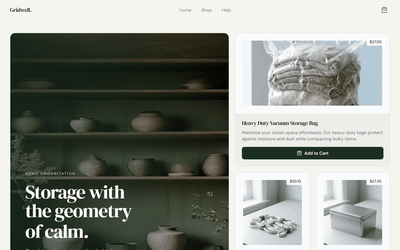<br/><sub>gridwell</sub></td>
<td width="25%" align="center"><br/><sub>harmonia</sub></td>
</tr>
<tr>
<td width="25%" align="center"><br/><sub>inkandecho</sub></td>
<td width="25%" align="center">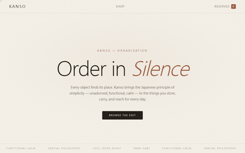<br/><sub>kanso</sub></td>
<td width="25%" align="center">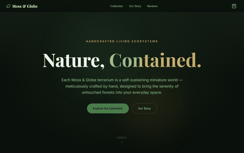<br/><sub>mossglobe</sub></td>
<td width="25%" align="center">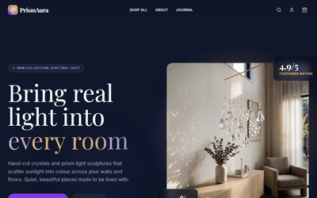<br/><sub>prismaura</sub></td>
</tr>
<tr>
<td width="25%" align="center"><br/><sub>streetcourt</sub></td>
<td width="25%" align="center">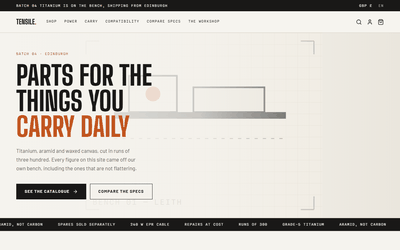<br/><sub>tensile</sub></td>
<td width="25%" align="center">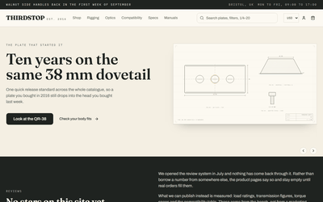<br/><sub>thirdstop</sub></td>
<td width="25%"></td>
</tr>
</table>

**所有線上站的清單，每一個都可以直接點開**：[`examples/live-sites.md`](examples/live-sites.md)

最新一輪的兩個：
[sg-thirdstop.vercel.app](https://sg-thirdstop.vercel.app) ｜ [sg-tensile.vercel.app](https://sg-tensile.vercel.app)

> 這兩個是最新一輪的產出，用來看現在這條線做出來長什麼樣，原始碼沒有收進本 repo。
> [`examples/`](examples/) 收錄的是另外三個站，挑的是風格差異最大的三個，原始碼與編譯版本都在。兩批的關係見 [`examples/README.md`](examples/README.md)。

<details>
<summary><b>🔢 上面這些數字是怎麼算的（點開核對）</b></summary>

<br/>

> **35 這個數字怎麼來的**：33 個是 2026-08-03 以前的存量，另 2 個是 2026-08-04 最新一輪的產出，
> 合起來 35。清單在 [`examples/live-sites.md`](examples/live-sites.md)：表格列的是前 33 個，
> 最新的兩個列在表格之後。
>
> **這四個數字不是同一件事**：35 是線上還在運作的站；23 是本機還留著原始碼的店專案
> （早期的站原始碼放在後來汰換掉的儲存裝置上，站還活著但本機沒有碼）；
> 20 是其中已編譯可直接部署的；3 是本 repo 精選收錄、風格差異最大的三個。

> **11 類與 15 個路由怎麼換算**：規範定義的 11 類必備頁面是首頁、商品大廳、分類、商品詳情、搜尋、購物車、結帳、登入註冊、會員中心、政策頁、關於我們。
> 實作時展開成 15 個路由：登入與註冊各一頁、會員中心拆成訂單與個人資料兩頁、政策頁展開成 FAQ／運送／退換／隱私四頁、分類則併進商品大廳的篩選。
> 這是最低標準，個別站可以再加自己的頁。清單見 [`production-line/references/site-architecture.md`](production-line/references/site-architecture.md)。

</details>

<details>
<summary><b>💻 想在自己電腦上打開其中一個店來看（不需要帳號、不需要金鑰）</b></summary>

<br/>

下載這個 repo 之後，在終端機打這一行：

```bash
cd examples/vanguard/dist && python -m http.server 8000
```

然後在瀏覽器打開 `http://localhost:8000`。**會看到一個完整的電商網站**，
可以逛商品、點進商品頁、加入購物車、走到結帳畫面。

**這一步跟任何 AI 工具無關。** 不需要登入、不需要帳號、不需要金鑰、不需要付費服務。
那行指令只是把已經編譯好的網站檔案在自己電腦上開起來，用的是系統內建的 Python。
關掉終端機就結束，不會在電腦上留下任何東西。

**不想動指令的話**，截圖在 [`examples/screenshots/`](examples/screenshots/)，
或直接點上面那份線上站清單。

</details>

---

## 這條線有多快

<table>
<tr>
<td align="center" width="33%"><h2>29 分鐘</h2><sub>單站產出時間<br/>兩個全新的站各自實測<br/>30.1 與 28.2 分鐘，差距 6%</sub></td>
<td align="center" width="33%"><h2>6 個站</h2><sub>同一天內完成過<br/>以各站的建置紀錄確認</sub></td>
<td align="center" width="33%"><h2>35 個站</h2><sub>目前在線上運作中<br/>2026-08-05 逐一 HTTP 實測皆可開啟</sub></td>
</tr>
</table>

兩個站是平行跑的，所以 29 分鐘是各自的實際耗時，不是兩站相加。

> ⚠️ 目前這些站尚未接金流、尚未開賣。**這個階段是建產能，不是生產。**

---

## 完整流程

上面那張是簡化版。這一張是每一步的實際順序，包含三個退回迴圈。

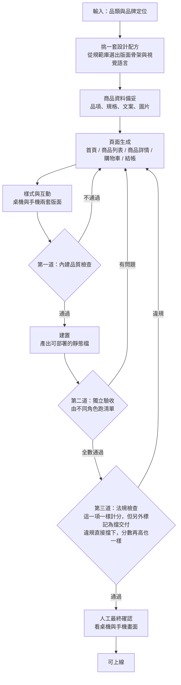

**三個地方刻意設成迴圈**，任何一道沒過都退回重做：

| 關卡 | 誰把關 | 沒過會怎樣 |
|---|---|---|
| 第一道｜內建品質檢查 | 產線內建 | 退回重做 |
| 第二道｜獨立驗收 | 由不同角色跑清單。**產出的角色不驗收自己的成品**，這道迴圈由不同角色觸發 | 退回重做 |
| 第三道｜法規檢查 | 標記為**擋交付項** | 違規一律擋下，分數再高也沒用 |

> **第三道的法規問題一樣算進分數，但它另外被標記成擋交付項**：獨立的是「擋交付」這個判定，不是「計分」。理由見 [`docs/how-it-works.md`](docs/how-it-works.md)。
> （這一道在內部文件裡叫「合規閘門」，指的是同一件事。）

**每個站用的設計配方都不一樣。** 版面骨架與配色每次重新組合，為的是讓每個站看起來都不像同一個模板做出來的。

---

## 13 個部門

照一間電商公司實際需要的職能劃分，不是照現有工具湊出來的。
各部門的職責與實際產出在 [`departments/`](departments/)。

一張圖看懂 13 個部門怎麼接力，節點上的數字是該部門的角色數：

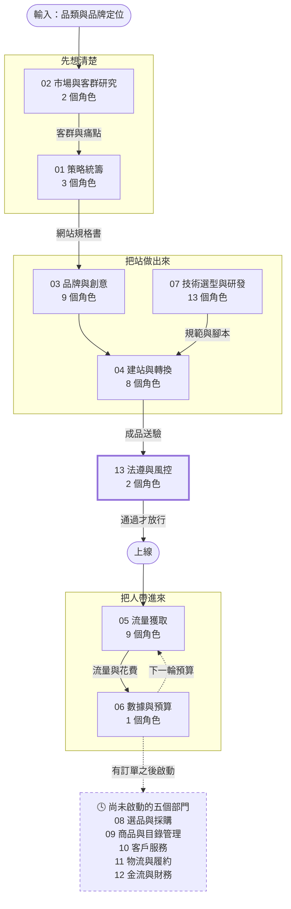

> 圖上各部門的角色數相加是 47，實際是 46 個：法遵與風控的合規稽核角色與流量獲取共用同一個。
> 法遵與風控在下表列在規劃中，但它已經在流程裡實際擋交付（上面流程圖的第三道檢查就是它），所以畫進主線。
> 46 個角色各自叫什麼、會哪幾支技能（共 179 支），見 [`departments/agent-map.md`](departments/agent-map.md)。

| ✅ 運作中（7 個） | 🕓 規劃中（6 個） |
|---|---|
| 策略統籌 | 選品與採購 |
| 市場與客群研究 | 商品與目錄管理 |
| 品牌與創意 | 客戶服務 |
| 建站與轉換 | 物流與履約 |
| 流量獲取 | 金流與財務 |
| 數據與預算 | 法遵與風控 |
| 技術選型與研發 | |

規劃中的六個大多是**有訂單之後才需要**的職能。目前完成的是「能不能賣」，尚未展開的是「賣出去之後怎麼處理」。

> **例外是兩個**：金流與財務不能等有量再說，第一筆真實交易發生的當下，對帳與退款規則就必須存在；
> 法遵與風控已經在擋交付了，上面流程圖裡的第三道檢查（法規檢查）就是它，只是還沒制度化。

---

## 技術棧


生產線跑在 Claude Code 的 Agent Skills 上（**Agent Skills 就是把做事的規範寫成純文字檔，AI 每次照著同一份檔案做**），
**規範與流程本身是平台無關的純文字資產**。

產出的網站與生產線完全解耦：React 19 + TypeScript + Vite + Tailwind CSS 3，
可部署到任何靜態主機，也可以交給任何前端工程師接手。

<details>
<summary><b>技術選型的理由：為什麼 Tailwind 還鎖在 3 而不是 4</b>（給工程師看的細節，點開才展開）</summary>

<br/>

**為什麼 Tailwind 還鎖在 3（`tailwindcss@^3`）而不是 4。** 兩個具體原因：
一是產線的設計鎖值目前是寫進 `tailwind.config.js` 的，例如動效規範要求把具名緩動曲線
註冊進 config 的 `transitionTimingFunction`（見 [`production-line/references/motion-system.md`](production-line/references/motion-system.md)），
Tailwind 4 改成 CSS 優先的設定方式，這批規範要整批改寫才會等效；
二是產線指定每個站都要用一個現成的 UI 元件庫（見 [`production-line/references/modern-ui-frameworks.md`](production-line/references/modern-ui-frameworks.md)），
換大版本要六個庫一起確認相容，成本落在驗證而不是升級本身。
**這是刻意鎖住的版本，不是沒注意到 Tailwind 4。** 已產出的站鎖在 3.4 是為了可重現；
升級要做的話是獨立一輪工作，先改規範再改樣板，不能只動一行版本號。

</details>


---

## 現況

| 區塊 | 狀態 | 說明 |
|---|---|---|
| **後端** | ✅ 已實跑驗證 | 已用 WordPress + WooCommerce 實跑驗證：商品自動上架、前台下單、後台看到訂單、庫存自動扣減。付款是模擬的。記錄與 16 張截圖在 [`docs/backend-poc.md`](docs/backend-poc.md)。 |
| **商品圖** | ⚠️ 過渡方案 | 目前站上的圖是**產線自己畫的技術規格卡，不是真實商品照**，因為這個階段沒有真實商品。正式上架時優先用廠商提供的真實照片。 |
| **前端展示介面** | 🕓 規劃中 | 見 [`frontend/README.md`](frontend/README.md)。 |
| **六個規劃中的部門** | 🕓 規劃中 | 見 [`docs/roadmap.md`](docs/roadmap.md)。 |

後端實跑的其中三張畫面：

<table>
<tr>
<td width="33%" valign="top" align="center">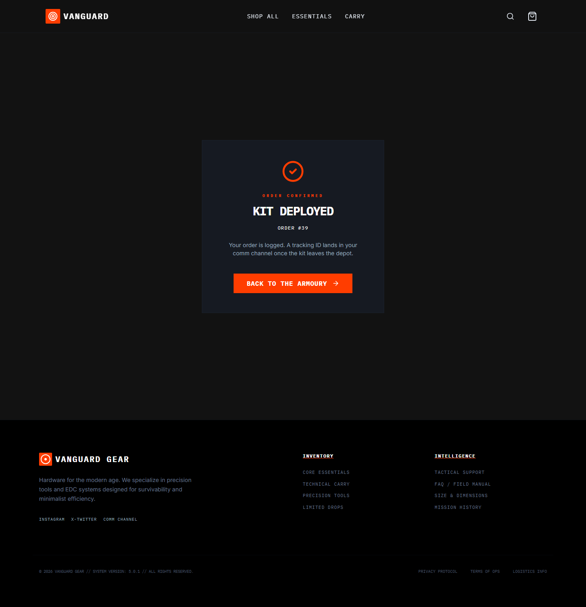<br/><sub>前台下單完成</sub></td>
<td width="33%" valign="top" align="center">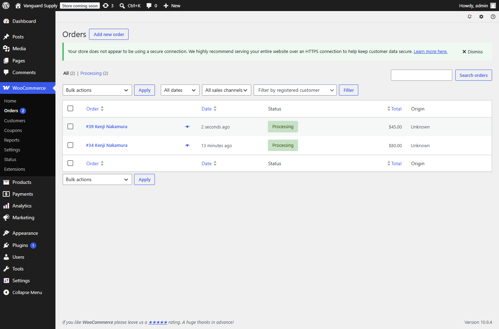<br/><sub>後台看到訂單</sub></td>
<td width="33%" valign="top" align="center">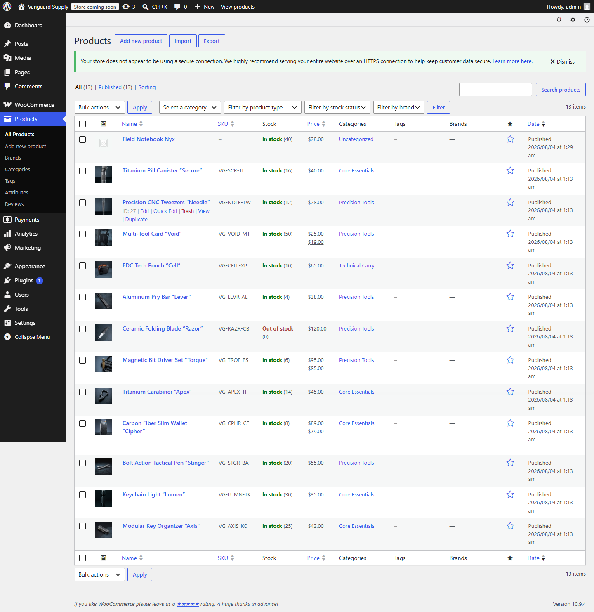<br/><sub>後台商品庫存</sub></td>
</tr>
</table>

> **商品圖的下一步**：廠商沒有圖時先找既有素材，
> **要做到有品牌感的 AI 生成圖則必須在本地生成，那需要專用硬體投入**。
> 線上生成服務有大量內容限制且不穩定，不適合量產。
> 三種來源的成本、限制與建議順序見 [`docs/product-images.md`](docs/product-images.md)。

---

## 目錄

| 路徑 | 內容 |
|---|---|
| [`docs/`](docs/) | 架構、流程、後端驗證紀錄、商品圖來源與成本 |
| [`departments/`](departments/) | 13 個部門的職責與實際產出 |
| [`production-line/`](production-line/) | 生產線本體：規範、腳本、已知問題 |
| [`quality/`](quality/) | 評分標準與交付驗收清單 |
| [`examples/`](examples/) | 三個完整範例站，以及 [所有線上站的清單](examples/live-sites.md) |
| [`frontend/`](frontend/) | 展示介面（規劃中） |
