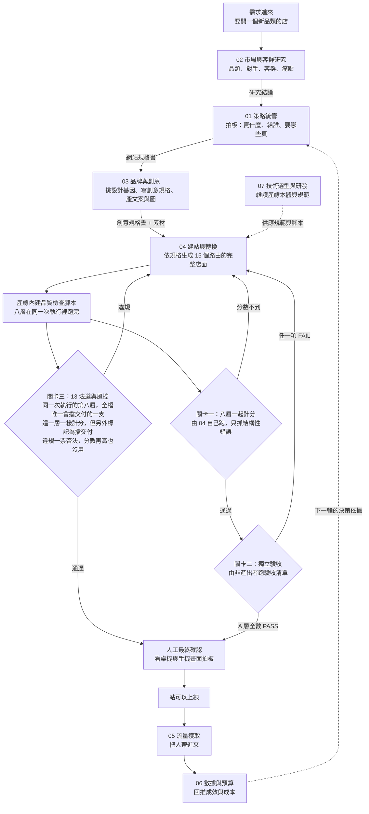

# 部門總表

照一間電商公司實際需要的職能來排，不是照手上現成有什麼工具湊出來的。7 個運作中，6 個下一步。

規劃中的六個大多是「有訂單之後才需要」的職能（下方有兩個例外）。目前完成的是「能不能賣」，還沒展開的是「賣出去之後怎麼處理」。

**每一份部門文件都寫三件事**：這個部門實際產出過什麼、用什麼在做、現在卡在哪。第三項寫得跟前兩項一樣仔細，沒有產出的就直接寫沒有。

每個部門底下實際有哪些 agent、每個 agent 會哪些技能，另外整理在 [agent-map.md](agent-map.md)：46 個角色、179 支技能的完整對照。

---

## 一個任務怎麼跨部門跑完全程

情境：**要開一個新品類的店，跑到站可以上線。**

## 誰交給誰，誰驗誰

| 環節 | 誰做 | 交出什麼 | 誰接手 |
|---|---|---|---|
| 1 | 02 研究 | 品類與客群的判斷依據 | 01 策略 |
| 2 | 01 策略 | 網站規格書：賣什麼、給誰、要哪些頁、視覺調性 | 03 創意 |
| 3 | 03 創意 | 創意規格書、設計基因、文案、圖 | 04 建站 |
| 4 | 04 建站 | 15 個路由的完整店面 | 關卡一 |
| 5 | 關卡一 | 同一次執行的八層結果，八層一起折算成分數，75 分以上才過 | 關卡二 |
| 6 | 關卡二 | 逐項 PASS/FAIL 表，每個 FAIL 附位置與證據 | 人工確認 |
| 7 | 關卡三 | 同一次執行第八層的合規判定，這一層一樣計分，但另外標記為擋交付，違規直接擋下 | 人工確認 |
| 8 | 人 | 可不可以交付 | 上線 |
| 9 | 05 流量 | 把人帶進站 | 06 數據 |
| 10 | 06 數據 | 成效與成本回推 | 01 策略，進下一輪 |

## 產出的部門不驗收自己的成品

**這條是硬規則，不是建議。**

流程裡有三道關卡，只有第一道是 04 號部門自己跑，那道只檢查結構性錯誤（破圖、缺價格、斷連結、行動版破版）。

**第二道由沒有參與產出的角色執行**，拿 [`../quality/acceptance-checklist.md`](../quality/acceptance-checklist.md) 逐項跑，用真實瀏覽器開站截圖，看使用者真正會看到的畫面，不看程式碼寫得漂不漂亮。回報格式固定為逐項 PASS/FAIL，每個 FAIL 要附具體位置與證據，禁止只回「看起來沒問題」，沒測到的項目要明說沒測。

理由寫在 [`../docs/how-it-works.md`](../docs/how-it-works.md)：同一個角色做完又自己驗，等於考生自己改考卷。做的人知道哪裡薄弱，就會不自覺避開那裡。

驗收清單裡還有一條更硬的：**驗收要能證明東西會壞，不是證明它沒壞**。所以清單第 11 項要求跑完全部檢查之後，故意製造一個已知的錯誤，確認檢查真的抓得到。抓不到就代表這份清單對這個站沒有偵測能力，全數 PASS 不算數。

**第三道是合規閘門**，分數擋不住它。法規類這一層一樣計分，但它另外被標記為攔截項，違規一律判定失敗，總分再高也沒用。它的自動偵測跟第一道寫在同一支腳本裡，是同一次執行的第八層，也是全檔唯一標記為攔截的一支，不是另外再跑一次；獨立的是判定，不是執行。這條規則的來源是實際踩過的坑：曾經有版本把所有檢查折算成分數加總，跑出 87 分判定通過，裡面帶著法規違規。

**最後一道留給人。** 這站夠不夠成熟、能不能交付，由人看桌機與手機截圖拍板。這一步刻意不自動化，因為品味目前沒有可靠的自動判準，硬做只會讓不夠好的東西過關。

## 六個規劃中的部門什麼時候接進來

上面那條線跑完只到「站可以上線」。**開賣之後才會用到的部門，現在全部不在流程上。**

順序是刻意的：在還沒開賣之前先建客服與物流，做出來的會是憑空想像的流程。理由寫在 [`../docs/roadmap.md`](../docs/roadmap.md)。

例外是兩個：**12 金流與財務**不能等有量再說，第一筆真實交易發生的當下，對帳與退款規則就必須存在；**13 法遵與風控**已經在擋交付了，只是還沒制度化。

## 總表

| 編號 | 部門 | 一句話職責 | 現況 |
|---|---|---|---|
| 01 | [策略統籌](01-strategy.md) | 接需求、拆派工、收斂成決策 | 運作中 |
| 02 | [市場與客群研究](02-research.md) | 查市場、競品、選品，定義客群與痛點 | 運作中 |
| 03 | [品牌與創意](03-brand-creative.md) | 品牌規範、創意方向、文案、視覺、影音 | 運作中 |
| 04 | [建站與轉換](04-site-conversion.md) | 量產電商站與落地頁，並優化轉換率 | 運作中 |
| 05 | [流量獲取](05-traffic.md) | 廣告投放、自然搜尋、社群經營 | 運作中，三個管道只有搜尋動了 |
| 06 | [數據與預算](06-data-budget.md) | 預算分配、成效試算、A/B 測試 | 運作中 |
| 07 | [技術選型與研發](07-tools-rd.md) | 掃描評估新工具，並確保接進日常工作流 | 運作中 |
| 08 | [選品與採購](08-sourcing.md) | 供應商、成本結構、跨境採購 | 尚未啟動 |
| 09 | [商品與目錄管理](09-catalog.md) | 商品上架、圖文規格、庫存對應 | 尚未啟動，上架已實測 |
| 10 | [客戶服務](10-customer-service.md) | 售前諮詢、售後、退換貨 | 尚未啟動，零產出 |
| 11 | [物流與履約](11-fulfillment.md) | 出貨、追蹤、跨境配送 | 尚未啟動，零產出 |
| 12 | [金流與財務](12-finance.md) | 收款、對帳、退款、匯率 | 尚未啟動，結帳已用模擬付款走通 |
| 13 | [法遵與風控](13-compliance.md) | 各國電商法規、廣告合規、平台政策 | 已有實際產出，尚未制度化 |
