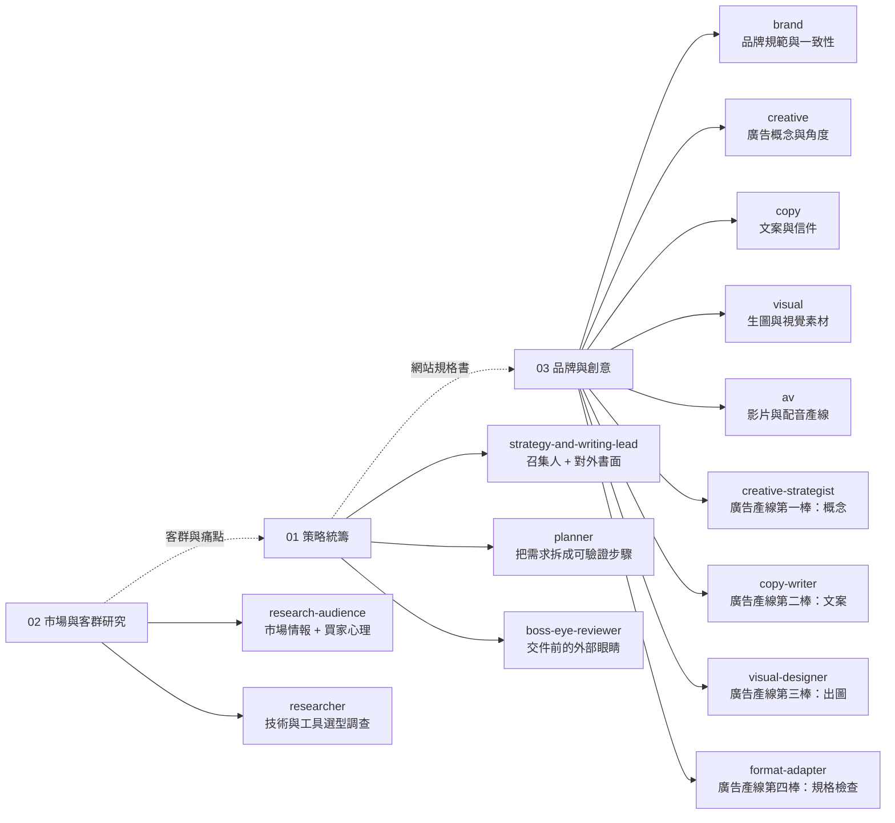
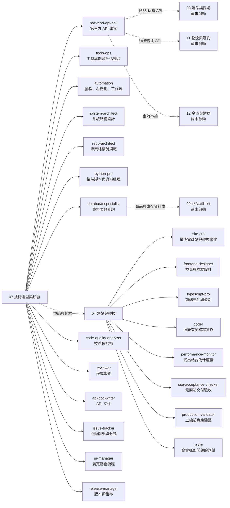
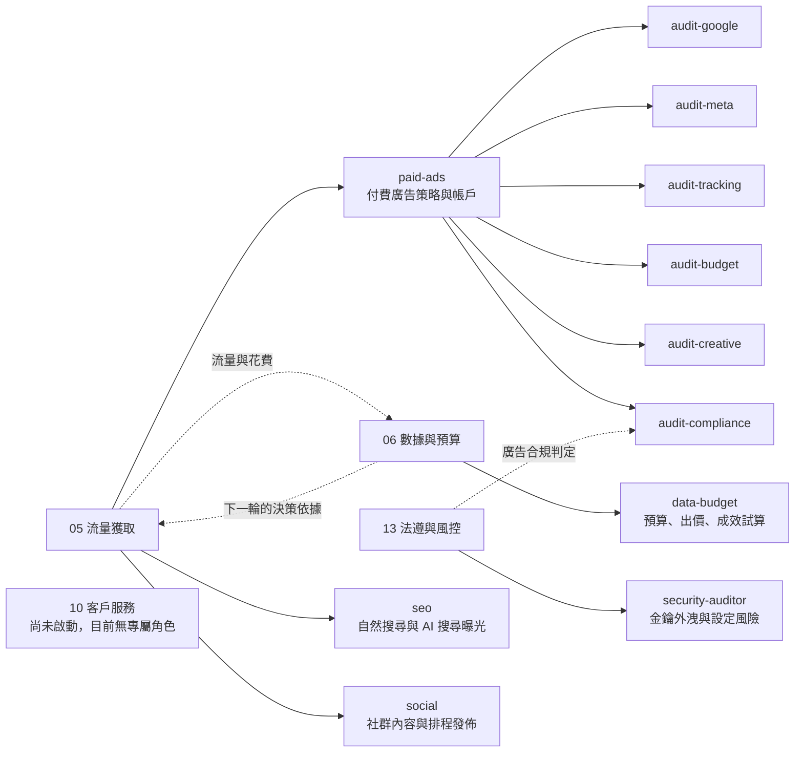

# 部門 → Agent → 技能 全圖

部門總表寫的是「這個部門負責什麼」。這一份寫的是「這個部門底下實際有誰、每個人會什麼」。

**本表只涵蓋電商產線與其營運相關的角色與技能。** 與電商無關的個人專案角色與技能已排除，也不計入下方任何數字（排除清單見文末）。

**這是能力盤點，不是狀態面板。** 全文不寫誰正在做什麼、做到幾成。每一列都是從角色定義檔與技能目錄實際數出來的，沒有估算，沒有推測；判斷不出來的標「未確認」。

---

## 一、規模

| 項目 | 數量 | 怎麼數的 |
|---|---:|---|
| 部門 | 13 | [部門總表](README.md)，7 個運作中、6 個尚未啟動 |
| Agent 角色定義檔（全機） | 48 | 部門型 15、開發型 21、專職型 12 |
| 納入本表的 Agent | **46** | 48 扣掉 2 個非電商角色 |
| 已安裝技能（全機） | 153 | `~/.claude/skills/` 底下的目錄數 |
| 有部門認領且納入本表的技能 | **140** | 由 46 個角色的定義檔逐條列出，每一支都確認過檔案存在 |
| 產線內建的專屬技能 | **39** | 隨 `auto-ecommerce-landing` 這個核心資產一起帶的，不重複計入上面 140 |
| 已安裝但目前無部門認領 | 11 | 見文末「沒人認領的技能」 |
| 排除的非電商技能 | 2 | 見文末排除清單 |

**技能總數 140 + 39 = 179 支。**

> ⚠️ **底下第三節逐部門列出的角色數相加會是 47，不是 46。**
> 差在法遵與風控的合規稽核角色與流量獲取共用同一個，兩邊都列到它，所以逐部門相加會多算一次。實際不重複的角色數是 46。

### 角色不是同一個等級

每個角色定義檔裡都指定了要用哪一階的模型跑，這是刻意分配的成本結構，不是全部用最貴的：

| 等級 | 用途 | 例子 |
|---|---|---|
| `fable` | 需要品味與視覺判斷 | 創意、視覺、前端設計、老闆視角驗收 |
| `opus` | 需要判斷、推理、拍板 | 策略、研究、建站、預算、資安 |
| `sonnet` | 有明確方法可循的執行 | SEO、社群、影音、六支廣告稽核 |
| `haiku` | 機械性、格式固定 | 開單追蹤、廣告素材尺寸檢查 |

---

## 二、關係圖

節點太多會糊掉，所以拆成三張：策略與內容、執行與產線、流量與把關。

### 圖 1：策略與內容（01、02、03）

### 圖 2：執行與產線（04、07，以及尚未啟動的 08 到 12）

### 圖 3：流量、數據與把關（05、06、10、13）

---

## 三、每個部門底下有誰、會什麼

技能名稱多半是英文代號，後面都補了白話。

---

### 01 策略統籌　（3 個角色）

| Agent | 負責什麼 | 會用哪些技能 |
|---|---|---|
| `strategy-and-writing-lead` | 接需求、判斷該找誰做、主持跨部門討論、把結論收斂成一個決定，再寫成上司或客戶看得懂的提案與報告 | `ads-plan`（整體廣告怎麼打）、`launch-strategy`（新品上市節奏）、`pricing-strategy`（定價）、`marketing-ideas`（點子發想）、`campaign-plan`（活動檔期結構）、`outbound-gate`（送出去收不回的東西先過這關）、`doc-coauthoring`（結構化提案）、`internal-comms`（內部溝通稿）、`sales-enablement`（銷售材料）、`prd`（把模糊需求寫成規格）、`html-ppt-zhangzara-signal`（極簡簡報樣式，非預設） |
| `planner` | 動手之前先把一件事拆成有順序、可以逐項驗證的步驟 | 不綁技能，產出的是步驟表 |
| `boss-eye-reviewer` | 用「第一次看到、沒有背景」的眼睛把交付物讀一遍，專挑前後矛盾、看不懂的內部術語、會被追問的模糊處。只出問題清單，不改東西 | 不綁技能，靠讀原件挑錯 |

> 為什麼驗收要獨立一個角色：做的人知道自己哪裡薄弱，會不自覺避開那裡。理由與規則寫在 [部門總表](README.md#產出的部門不驗收自己的成品)。

---

### 02 市場與客群研究　（2 個角色）

| Agent | 負責什麼 | 會用哪些技能 |
|---|---|---|
| `research-audience` | 對外查市場、對手、趨勢、選什麼品；對內看銷售數據。同時負責回答「買的人是誰、他在煩什麼、他為什麼不買」 | `ecommerce-research-report`（三個以上選項要比就出比較報告，每份換一套視覺）、`boss-live-report`（多來源查證報告 + 可開的連結）、`ads-competitor`（對手在投什麼廣告）、`agent-reach`（免費讀網頁／YouTube／GitHub／社群做一手研究）、`avatar-extraction`（把目標客戶寫成具體的人）、`marketing-psychology`（心理框架套進訊息）、`schwartz-awareness-mapper`（客人現在知道多少，訊息該從哪切）、`offer-extraction`（到底在賣什麼）、`objection-crusher`（列出不買的理由並逐條破解） |
| `researcher` | 查技術選項、函式庫、API、對手怎麼做的，重點是找現成的來用而不是自己造 | 讀網頁與程式碼，不綁行銷類技能 |

---

### 03 品牌與創意　（9 個角色）

這是角色最多的部門，因為它同時包含「判斷型」與「產線型」兩種角色。

**判斷型：接到需求要先想方向**

| Agent | 負責什麼 | 會用哪些技能 |
|---|---|---|
| `brand` | 定義並守住品牌長什麼樣、講話什麼調性，把關所有對外產出的一致性與「不要一看就是 AI 寫的」 | `ads-dna`（從一個網址反推出品牌基因，輸出成設定檔）、`brandkit`（套用品牌規範）、`brand-review`（一致性審查）、`product-marketing-context`（定位與核心訊息，所有行銷技能開工前先讀它）、`userinterface-wiki` + `wcag-audit-patterns`（介面一致性與無障礙檢查） |
| `creative` | 想廣告要怎麼打：概念、切入角度、鉤子、訊息主軸，然後指揮文案與視覺去執行 | `ads-create`（產出活動概念與 brief）、`ad-angle-multiplier`（一個點子擴成多個角度去測）、`scroll-stopping-creative`（設計讓人停下滑動的開頭）、`hook-lab`（拆解別人爆紅的短影音，拆出鉤子結構）、`mechanism-builder`（把產品講出一個別人沒有的機制） |
| `copy` | 寫會讓人買單、而且像真人寫的字 | `copywriting`（各種頁面與商品文案）、`ad-creative`（規模化產廣告文案變體）、`headline-matrix`（系統化產一整組標題）、`copy-editing`（潤飾既有文案）、`email-sequence`（自動信件流、回購與喚醒信）、`cold-email`（B2B 冷開發信）、`generic-language-killer`（送出前掃掉空話與 AI 腔） |
| `visual` | 出圖：廣告圖、商品圖、情境圖、banner、活動視覺 | `generate-image`（一般生圖）、`ads-generate`（依 brief 產各平台尺寸廣告圖）、`ads-photoshoot`（一張商品圖變五種攝影風格）、`canvas-design`（靜態構圖與 banner）、`ui-ux-pro-max`（50 種風格、配色、字型選型庫）、`oklch-skill`（配色換算與對比檢查）、`interface-design`（後台與儀表板）、`image-to-code`（設計圖轉程式碼）、`imagegen-frontend-web` / `imagegen-frontend-mobile`（生圖式前端頁）、`industrial-brutalist-ui` / `minimalist-ui` / `stitch-design-taste`（三套風格預設）、`transitions-dev`（轉場微動效）、`baseline-ui`（動畫時長與可用性稽核）、`gpt-taste`（得獎級動效）、`algorithmic-art`（生成藝術）、`frontend-slides`（HTML 動態簡報）、`threejs-skill-router` 加底下 23 支 3D 專家技能（立體場景、粒子、材質、光影等，共 24 支） |
| `av` | 影片的上游與自動產線：腳本、分鏡、配音、AI 生成、自動出成片 | `ad-factory`（用廣告公司流程量產 9:16 短影音）、`remotion-best-practices`（用程式做資料驅動影片）、`shorts`（長片自動轉短版精華）、`watch`（抽幀讀畫面，檢查構圖與字幕安全區） |

> `av` 只做到「素材與自動產線成片」為止。一支一支的手工剪接不歸這個部門。

**產線型：接固定的輸入、走固定的四棒，用在批量產廣告素材**

| Agent | 負責什麼 | 會用哪些技能 |
|---|---|---|
| `creative-strategist` | 第一棒。讀品牌設定檔，產出活動概念、訊息支柱、各平台創意方向，寫進 `campaign-brief.md` | 不綁技能，讀 `brand-profile.json` 產結構化 brief |
| `copy-writer` | 第二棒。照 brief 寫符合各平台字數限制的標題、主文、CTA，寫之前先驗字數 | 不綁技能，照平台規格產文案 |
| `visual-designer` | 第三棒。照 brief 組出五段式生圖指令去出圖，分類存檔並產出清單檔 | 透過生圖引擎出圖 |
| `format-adapter` | 第四棒。檢查每張圖尺寸有沒有中、安全區有沒有壓到、少了哪些格式，寫成報告 | 不綁技能，做的是尺寸與規格核對 |

---

### 04 建站與轉換　（8 個角色）

| Agent | 負責什麼 | 會用哪些技能 |
|---|---|---|
| `site-cro` | 量產看不出是 AI 做的電商站與落地頁，並把進站的人變成訂單與回購。核心產線資產的主人 | **建站**：`auto-ecommerce-landing`（核心資產，一鍵產完整電商站）、`frontend-design`（高質感前端）、`theme-factory`（主題變體）、`design-taste-frontend` / `high-end-visual-design`（讓成品不像 AI 做的）、`redesign-existing-projects`（既有站改版）。**轉換**：`page-cro`（任何頁面的轉換優化）、`ads-landing`（廣告落地頁的訊息銜接）、`conversion-path-builder`（從點擊到成交的漏斗設計）、`form-cro` / `popup-cro` / `signup-flow-cro` / `onboarding-cro` / `paywall-upgrade-cro`（表單、彈窗、註冊、首次使用、升級各環節）、`churn-prevention`（降流失、拉回購） |

> ⚠️ **`gsap-awwwards-website` 刻意不列在建站清單裡。**
> 產線的動效規則（`production-line/references/motion-system.md`）明文規定：同一個站禁止混搭第二套動效引擎，一律只用 `motion/react`。
> 那支技能仍然存在，但用在電商產線以外的場合。**這裡少列它是刻意的，不是漏了。**

| `frontend-designer` | 視覺與前端設計的統一入口：介面、排版、動效、改版方向 | 與 `visual` 共用設計技能群 |
| `typescript-pro` | 寫前端元件與邏輯（Next.js / React / Tailwind 這一套） | 依專案既有技術棧 |
| `coder` | 照既有程式風格把功能實作出來，用在已經有計畫之後 | 不綁技能 |
| `performance-monitor` | 找出站台為什麼慢：頁面太肥、沒壓縮、查詢慢、圖太大。先量再建議 | 量測後給建議 |
| `site-acceptance-checker` | 拿驗收清單對「別人做好的站」逐項判 PASS / FAIL，用真實瀏覽器看使用者會看到的畫面，不看程式碼漂不漂亮。只驗不改 | `playwright-cli`（開真的瀏覽器操作與截圖） |
| `production-validator` | 上線前實際跑一次、看真實行為，禁止空口說「好了」 | 不綁技能，靠實跑 |
| `tester` | 寫在「商業邏輯變了」時才會失敗的測試，不寫只為了通過的假測試 | 不綁技能 |

> 這個部門刻意放了三個不同的驗證角色：`tester` 寫測試、`production-validator` 確認改動真的跑得起來、`site-acceptance-checker` 只驗電商站使用者看到的畫面。分開是因為三件事抓的是不同層的問題。

---

### 05 流量獲取　（9 個角色）

| Agent | 負責什麼 | 會用哪些技能 |
|---|---|---|
| `paid-ads` | 全平台付費廣告的策略、帳戶架構、受眾設定、素材品質把關 | `ads` / `ads-audit`（跨平台總體稽核與評分）、`ads-google`、`ads-meta`、`ads-tiktok`、`ads-linkedin`、`ads-microsoft`、`ads-youtube`、`ads-apple`（八個平台各自的深度分析）、`ads-creative`（跨平台素材疲乏與規格合規檢查）、`paid-ads`（投放策略與架構） |
| `seo` | 帶來不用花錢的搜尋流量，包含讓內容被 ChatGPT 與 Perplexity 這類 AI 引用 | `seo-audit`（技術與頁面健檢）、`ai-seo`（被 AI 搜尋引用）、`schema-markup`（結構化資料，讓搜尋引擎讀懂頁面在賣什麼）、`programmatic-seo`（規模化產生 SEO 頁）、`site-architecture`（站台結構與內鏈）、`competitor-alternatives`（競品比較頁，同時吃搜尋與銷售）、`content-strategy`（內容主題與行事曆） |
| `social` | 經營自有社群、把粉絲變流量與名單，並負責排程自動發佈 | `social-content`（各平台社群內容）、`referral-program`（推薦與裂變機制）、`lead-magnets` / `free-tool-strategy`（用免費的東西換名單） |
| `audit-google` | 專查 Google 廣告帳戶：轉換追蹤、白花的錢、帳戶結構、關鍵字、品質分數、素材、出價與設定 | 稽核報告 |
| `audit-meta` | 專查 Meta 廣告帳戶：像素與伺服器端追蹤健康度、素材多樣性與疲乏、帳戶結構、學習期、受眾 | 稽核報告 |
| `audit-tracking` | 專查追蹤有沒有裝對：像素安裝、伺服器端追蹤、事件設定、歸因（LinkedIn / TikTok / Microsoft） | 稽核報告 |
| `audit-budget` | 專查錢怎麼分、怎麼出價、學習期健康度、受眾與活動結構（LinkedIn / TikTok / Microsoft） | 稽核報告 |
| `audit-creative` | 專查素材品質：格式多樣性、疲乏訊號、夠不夠像該平台原生內容、規格合不合 | 稽核報告 |
| `audit-compliance` | 專查合規：法規、廣告政策、隱私要求、活動設定與成效基準 | 稽核報告 |

> 六支 `audit-*` 是同一套稽核工具的六個切面，設計成可以同時跑、各自產一份報告，最後由 `paid-ads` 收斂。

---

### 06 數據與預算　（1 個角色）

| Agent | 負責什麼 | 會用哪些技能 |
|---|---|---|
| `data-budget` | 管錢與管數字：預算怎麼分、出價怎麼設、這檔到底賺不賺、要不要加碼或砍掉、實驗怎麼設計、數字有沒有量對 | `ads-budget`（預算分配與出價規則）、`ads-math`（廣告財務試算：每次成交成本、廣告投報率、打平點、客戶終身價值對取得成本）、`analytics-tracking`（追蹤設定與量測健檢：GA4／GTM／事件／UTM）、`ab-test-setup`（A/B 測試規劃：假設、要多少樣本、跑多久才算數）、`ads-test`（各平台的實驗設定）、`performance-diagnosis`（成效不好時往下挖五層根因）、`revops`（營收流程與營運數據）、`xlsx`（試算表產出） |

> 這個部門只有一個角色但技能密度最高，因為「算帳」這件事不適合拆給多個角色各算一套。帳戶端的投放操作歸 05，這裡只管數字與判斷。

---

### 07 技術選型與研發　（13 個角色）

| Agent | 負責什麼 | 會用哪些技能 |
|---|---|---|
| `tools-ops` | 找新工具、評估值不值得引進，引進之後負責讓它真的有人用、不要裝了放著 | `opensource-eval`（丟一個 GitHub 連結自動出評估，會用官方 API 查星數防灌水）、`find-skills`（問「有沒有現成的能做 X」時去找）、`skill-creator`（把一套做法包成可重複使用的技能）、`skill-fusion` / `fuse-dont-discard`（兩支技能重複時判斷要合併還是淘汰）、`self-distillation`（用實際使用數據抓出被冷落的技能與重複犯的錯）、`prompt-enhancer`（把給其他 AI 的指令寫好）、`agent-reach`（免費讀多平台）、`notebooklm`（研究知識庫全套 API）、`graphify`（任何輸入轉成關係圖） |
| `automation` | 所有「重複、固定、不需要臨場判斷」的事：排程、開機自啟、看門狗、把流程串成自動工作流 | `playwright-cli`（瀏覽器自動化：自動填表、爬頁、自動化測試）、`schedule` / `loop`（定時重複執行）、`llm-proxy-integration`（代理層設定與排障）、`openclaw-google-auth-recovery`（登入憑證過期時的恢復程序）、n8n 工作流引擎與 301 個現成範本 |
| `system-architect` | 設計一個網站或應用的整體結構：元件怎麼切、資料怎麼流、技術棧配不配。只設計不實作 | 不綁技能 |
| `repo-architect` | 設計與整理專案目錄結構、設定檔、命名慣例 | 不綁技能 |
| `python-pro` | 後端邏輯、資料處理管線、爬蟲、自動化腳本 | 不綁技能 |
| `backend-api-dev` | 串接第三方 API：採購平台、物流、金流 | 不綁技能 |
| `database-specialist` | 設計資料表、寫與優化查詢、規劃資料搬遷 | 不綁技能 |
| `code-quality-analyzer` | 掃出重複、過度複雜、技術債熱點。只回報不動手 | 不綁技能 |
| `reviewer` | 讀改動找真正會出錯的地方，順帶找可以簡化或重用的部分。只讀不改 | 不綁技能 |
| `api-doc-writer` | 把端點與程式轉成看得懂的 API 文件，不動執行中的程式 | 不綁技能 |
| `issue-tracker` | 把零散的問題回報或想法整理成一張可以動手的單 | 不綁技能 |
| `pr-manager` | 準備與說明變更、跑審查流程 | 不綁技能 |
| `release-manager` | 版本、變更紀錄、發布步驟，發布前先確認建置與測試有過 | 不綁技能 |

---

### 08 選品與採購　尚未啟動

目前沒有專屬角色。真的要動的時候，採購平台的 API 串接由 07 的 `backend-api-dev` 接手，市場與選品判斷由 02 的 `research-audience` 出。

已安裝但還沒有部門認領的 `cross-border-ecommerce`（跨境電商）技能，內容上最貼近這個部門，尚未指派。

---

### 09 商品與目錄管理　尚未啟動

目前沒有專屬角色。商品與庫存的資料結構由 07 的 `database-specialist` 支援，商品圖與圖文規格由 03 的 `visual` 支援。

---

### 10 客戶服務　尚未啟動

**目前沒有任何專屬角色，也沒有綁定技能。** 相鄰能力散在別的部門：`churn-prevention`（降流失）在 04、`email-sequence`（自動信件流）在 03。這兩支都不是客服，只是離客服最近的東西。

順序是刻意的：還沒開賣就先建客服流程，做出來的會是憑空想像的流程。理由寫在 [`../docs/roadmap.md`](../docs/roadmap.md)。

---

### 11 物流與履約　尚未啟動

目前沒有專屬角色。物流查詢與追蹤的 API 串接由 07 的 `backend-api-dev` 接手。

---

### 12 金流與財務　尚未啟動

目前沒有專屬角色。金流串接由 07 的 `backend-api-dev` 接手，對帳與數字試算由 06 的 `data-budget` 支援。

這個部門不能等有量再說：第一筆真實交易發生的當下，對帳與退款規則就必須存在。

---

### 13 法遵與風控　（2 個角色）

| Agent | 負責什麼 | 會用哪些技能 |
|---|---|---|
| `security-auditor` | 找金鑰有沒有外洩、有沒有注入風險、安全標頭有沒有漏、權限有沒有破口、設定安不安全。只評估不動手 | 不綁技能 |
| `audit-compliance` | 廣告與活動端的合規判定：法規、平台政策、隱私要求 | 稽核報告 |

> 這個部門的判定是三道交付關卡裡唯一會直接擋下交付的一道。違規一票否決，分數再高也沒用。規則寫在 [部門總表](README.md#產出的部門不驗收自己的成品)。

---

## 四、產線自帶的 39 支技能

核心資產 `auto-ecommerce-landing` 內部另外帶了 39 支技能，隨產線一起走，不需要另外安裝。分成四類：

| 類別 | 支數 | 內容 |
|---|---:|---|
| 前端與設計 | 8 | 前端設計、Tailwind 樣式模式、行動版設計、網頁設計準則、介面選型、Next.js／React 專家、應用建置、國際化與多語 |
| 品質與測試 | 8 | 測試模式、測試驅動流程、網頁應用測試、程式碼審查清單、乾淨程式碼、系統化除錯、靜態檢查與驗證、效能剖析 |
| 架構與資料 | 5 | 架構設計、資料庫設計、API 模式、Node.js 實務、文件範本 |
| 系統與流程 | 18 | 部署程序、伺服器管理、Windows 與 Linux 指令、生圖、SEO 基礎、地理在地化、智慧路由、平行代理、計畫撰寫、腦力激盪、行為模式、紅隊測試、漏洞掃描、MCP 建置、Python 模式、Rust、遊戲開發等 |

> **其中有幾支跟電商產線無關**（遊戲開發、Rust），是上游套件一起帶進來的，目前沒有清掉。列在這裡是為了誠實反映實際內容，不是宣稱它們有在用。

---

## 五、誠實欄：重疊、未確認、沒人認領

盤點過程中實際發現的，不是推測：

**職能重疊，邊界已寫下但尚未收斂**

1. `visual`（生圖）、`frontend-designer`（前端設計）、`visual-designer`（廣告產線出圖那一棒）三支都會被「設計／視覺」類需求叫到。邊界寫在各自的定義檔裡，但三支的觸發詞有交集。
2. `gpt-taste` 與 `design-taste-frontend`、`high-end-visual-design` 三支技能職能重疊，`visual` 的定義檔自己標註「尚未做融合判斷，先各自保留」。
3. `skill-fusion` 與 `fuse-dont-discard` 是同一個判斷框架的兩份，`tools-ops` 的定義檔自己標為「候選融合案，尚未處理」。
4. 廣告產線的四棒（`creative-strategist` / `copy-writer` / `visual-designer` / `format-adapter`）與 03 的判斷型角色（`creative` / `copy` / `visual`）能力重疊。差別是前者走固定輸入與固定流程，後者要臨場判斷。這是刻意的分工，不是冗餘，但兩套並存代表同一件事有兩條路徑。

**未確認**

5. `seomachine`（把真實流量數據串進 SEO 健檢）被 `seo` 的定義檔標為「找不到對應技能的低信心引用」，用之前要先確認裝了沒。本表不把它算進 140 支。

**已安裝但目前沒有部門認領（11 支）**

`code-simplification`、`context-engineering`、`control-randomness`、`cross-border-ecommerce`、`doubt-driven-development`、`full-output-enforcement`、`humanizer`、`omo-orchestrator`、`supabase`、`supabase-postgres-best-practices`、`video-shotcraft`

其中 `cross-border-ecommerce` 與電商直接相關，卻沒人領，這是盤點出來最該處理的一項。

**版本殘留**

6. `dept/automation`、`dept/tools-ops`、`dev/coder` 三個角色各留了一份 2026-07-29 的舊版備份檔在同一個目錄下。不影響運作，但同一個目錄裡有兩份同名角色定義，是會出事的結構。

---

## 六、排除清單（本表不含，也不計入任何數字）

這份文件只涵蓋電商網站產線與其營運。以下角色與技能與電商產線無關，已排除：

| 類型 | 名稱 | 為什麼排除 |
|---|---|---|
| Agent | `spell` | 屬於另一個獨立的內容專案，與電商產線無交集 |
| Agent | `market-intel-gray` | 灰色地帶市場情報單位，是情報角色不是產線角色，不列入產線盤點 |
| 技能 | `spell-forge` | 同上，屬 `spell` 的專用技能 |
| 技能 | `spell-architect` | 同上 |

排除後：Agent 48 → 46，已安裝技能 153 支中納入 140 支。
