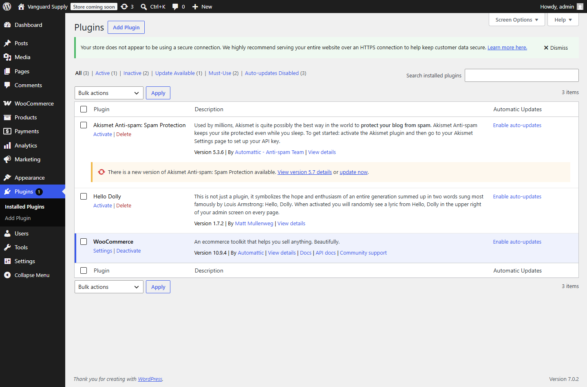
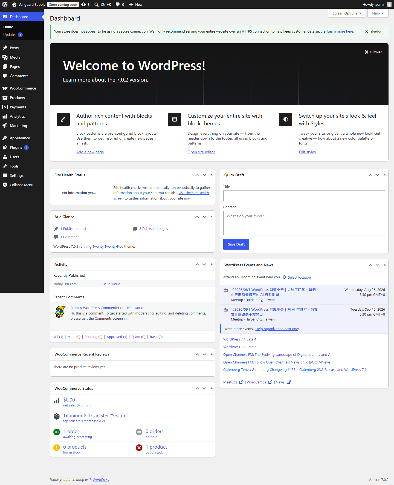
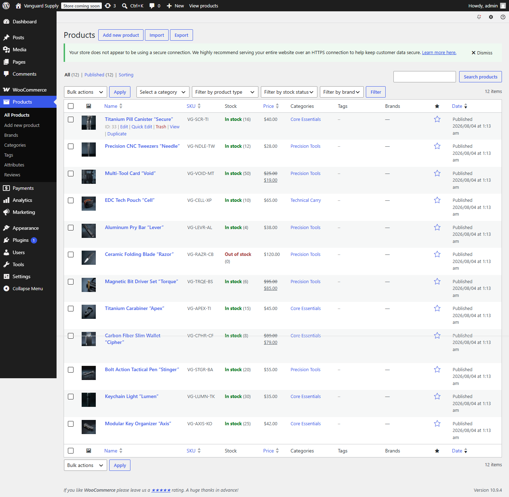
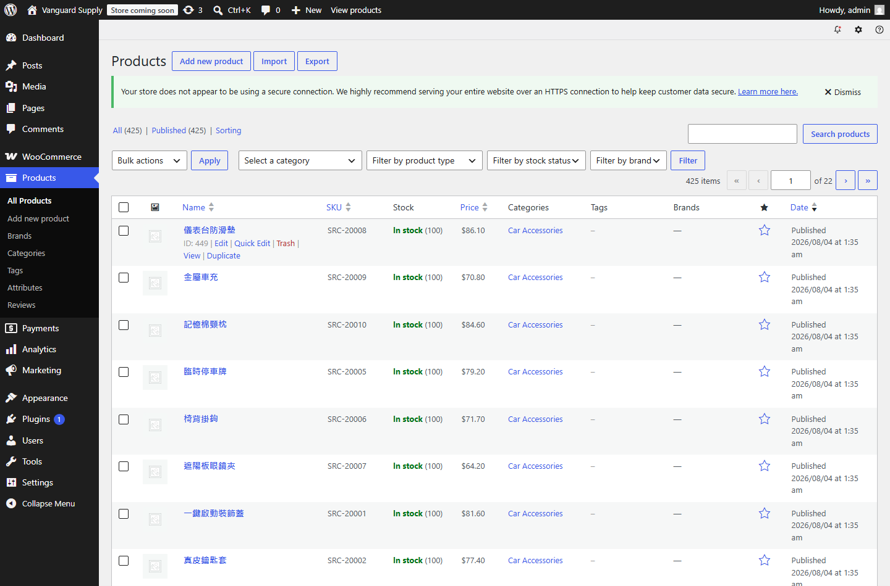
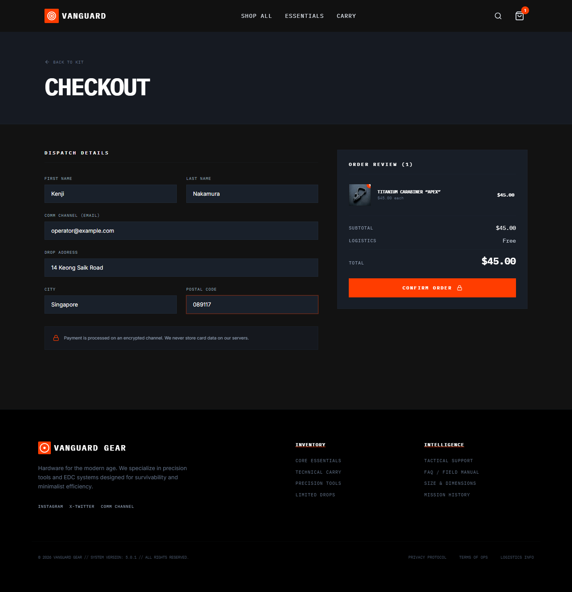
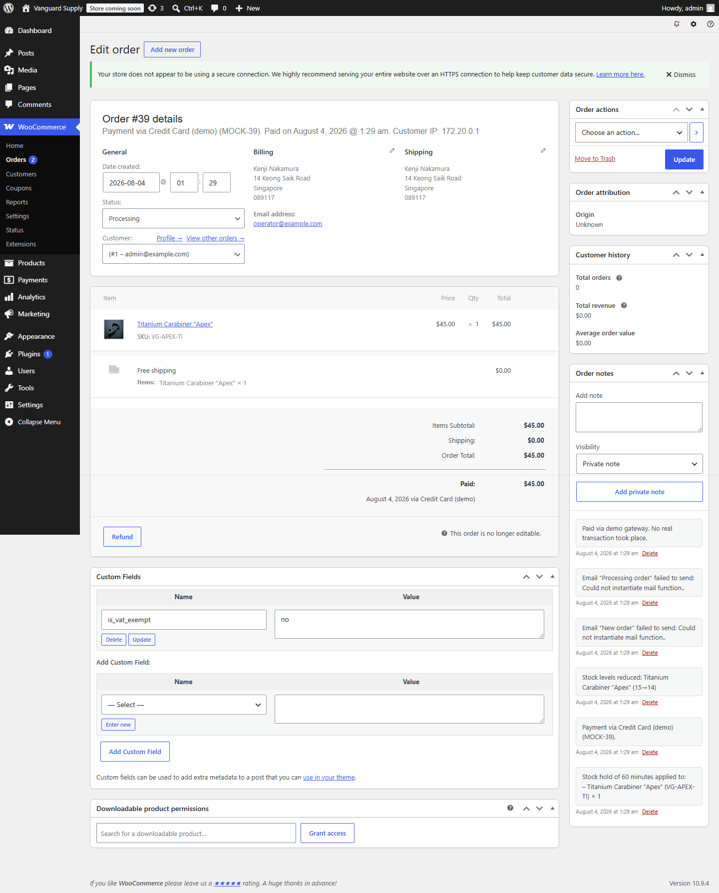

# 商店後端試跑紀錄

## 一句話結論

後端已經在一台普通電腦上跑起來，而且走完了一次完整的買賣：在管理後台手動新增一個商品，前台網站立刻看得到；客人把商品加入購物車、填地址、送出訂單；後台馬上出現這筆訂單，商品庫存也自動從 15 件變成 14 件。

**付款那一步是模擬的。** 按下確認之後系統直接當作已付款，沒有接任何真實的刷卡或轉帳。這一點在下面「付款是假的」一節會再講清楚。

---

## 先把幾個名詞講白話

這份文件會反覆用到幾個詞，先一次講完。

| 名詞 | 白話解釋 |
| --- | --- |
| 前台 | 客人看到的購物網站，可以逛商品、加入購物車、結帳。 |
| 後台 | 只有自己人能進的管理畫面，用來新增商品、看訂單、改庫存。 |
| 後端 | 前台和後台背後那台實際記帳的機器，商品、訂單、庫存都存在這裡。前台只是它的一張臉。 |
| 容器 | 一種把整套軟體連同它需要的環境打包起來的做法。好處是不用在電腦上一個一個安裝，一行指令就能整套開起來，也能整套關掉、刪乾淨，不會弄髒電腦。 |
| 介面 | 兩套系統之間互相講話的管道。前台問後端「現在有哪些商品」、上架工具跟後端說「請新增這 412 個商品」，走的都是這條管道。 |
| 上架 | 把商品的名稱、價格、圖片、庫存放進後端，讓它在前台出現。 |

---

## 這套東西由哪幾塊組成

全部都跑在本機，不需要租主機。

| 元件 | 做什麼 | 狀態 |
| --- | --- | --- |
| 商店主程式 | 提供後台、商品、訂單、庫存 | 已跑起來，版本 7.0.2 |
| 商店外掛 | 讓主程式變成一間電商，提供購物車、結帳、訂單、庫存扣減 | 已安裝並啟用，版本 10.9.4 |
| 資料庫 | 真正存放商品和訂單的地方 | 已跑起來 |
| 指令工具 | 讓安裝設定可以用指令自動完成，不用一頁一頁點 | 已跑起來 |
| 模擬付款外掛 | 自己寫的，讓結帳流程可以走完 | 已啟用，**不是真金流** |
| 跨網域設定外掛 | 自己寫的，允許前台網站跟後端要資料 | 已啟用 |



後台的外掛清單，WooCommerce 10.9.4 那一列的動作是「Deactivate」，代表現在是啟用中的狀態。

檔案都放在 `production-line/backend/`。

---

## 怎麼把它跑起來

需要先裝好容器軟體並且讓它在執行中。之後只要一行：

```bash
cd production-line/backend
bash setup.sh
```

這支腳本會自己做完這些事：開容器、等網站活過來、安裝商店主程式、安裝並啟用商店外掛、設定幣別與國別、建立購物車與結帳頁、加一個免運方式、產生一組給程式用的通行憑證、最後確認商品查詢管道有回應。

跑完會印出後台網址、管理帳號與密碼。用那組帳密登進去就是這個畫面：



左側選單已經有 WooCommerce 與 Products，下方的 WooCommerce 狀態區塊也已經在統計訂單與庫存，
代表主程式與商店外掛都裝好而且接上了。

**這支腳本是實測過的，不是照著記憶寫的。** 驗證方式是另外開一套全新的、完全空白的環境跑一次，從零跑到商品查詢管道回應正常，然後把那套測試環境整個刪掉，沒有動到示範用的那一套。

重複跑不會壞。每一步都會先檢查做過沒有，做過就跳過。

如果 8088 這個埠號被別的東西占用了，可以換：

```bash
WP_PORT=8090 ACP_PREFIX=demo ACP_PROJECT=demo-backend bash setup.sh
```

收工要把它關掉：

```bash
docker compose down
```

加上 `-v` 會連同商品和訂單一起刪光，要小心。

---

## 商品怎麼自動上架

重點是**不用人一個一個手動打**。做法是先把商品資料整理成一份統一格式的清單，再用一支工具把整份清單推進後端。

目前有兩個來源，兩個都實測過。

### 來源一：網站自己內建的示範商品

生成出來的前台網站，裡面本來就帶著一份示範商品清單。有一支轉換工具可以把那份清單直接變成上架用的格式：

```bash
node bin/export_mock_feed.mjs <網站>/src/data/mockData.ts feeds/store.json
python bin/import_products.py feeds/store.json --assets-root <網站>/public
```

**實測結果：12 個商品、3 個分類、12 張商品圖，全部成功，沒有失敗。** 圖片是真的被搬進後端的圖庫，不是連到外面的網址。



後台清單上 **12 items**，每一筆左側都有縮圖，那些縮圖是後端自己圖庫裡的檔案，不是外連。

### 來源二：商品池

也接了一份真實的商品池，裡面是 20 個分類、412 個品項，每個品項有名稱、重量、採購成本與供應商連結。**這是貨源目錄，不是一份待上架的清單**：設計上一次只從裡面挑一個分類，開一個站。換一個池子就能繼續產出彼此不重複的站。

```bash
# 正常走法：只轉池子裡的一個分類，開一個站
python bin/feed_from_sourcing.py <商品池>.json feeds/sourcing.json --category "Sound Healing Tools" --markup 3.0
python bin/import_products.py feeds/sourcing.json --skip-images
```

轉檔工具剛加了 `--category`，可以只轉一個分類（不加就是整池全轉，那是壓力測試的走法）；另外它現在會把採購成本、重量、供應商連結三個欄位一起帶出來，之前這三個會在轉檔時被丟掉。**repo 裡現存的 `feeds/sourcing.json` 是改之前產出的，那份裡面沒有這三個欄位，要重跑一次才會有。**

**實測結果：整池 412 個商品一次全部上架成功，0 個失敗。** 這一次測的是量推不推得動，不是一個店真的要放 412 個商品；正常一個站只承接池子裡的一個分類，大約 20 到 30 個商品。售價是用採購成本乘上一個固定倍率算出來的，倍率寫在指令裡可以改，這只是暫時的算法，不是真的定價策略。

這裡有兩個數字，不要混淆。**這一次推進去的是 412 個**，那是整個商品池的品項數。**推完之後商店裡總共有 425 個**，因為原本就已經有 12 個示範商品加上 1 個後台手動新增的商品。425 減 13 等於 412。截圖上顯示的 425 是商店總數，不是這次上架的數量。



上面這張是上架完成後的後台商品列表：右上角 **425 items**、分頁顯示 **第 1 頁／共 22 頁**，
清單裡是商品池帶進來的中文品名（儀表台防滑墊、金屬車充、記憶棉頸枕…），
每一筆都有 SKU、庫存、售價與分類，狀態是已發佈。

這兩個數字都是直接查資料庫確認過的，不是從畫面推算的：上架前資料庫是 13 筆，上架後是 425 筆，把商品池那批移除之後又回到 13 筆。

這批商品在拍完證明用的截圖之後就刪掉了，因為它們和示範網站的品牌對不上，留著會讓示範畫面很亂。工具和商品池都留著，隨時可以再跑。

### 重複跑不會變成兩份

上架工具是用商品編號比對的。同一份清單跑第二次，它會去更新原本那批，不會多開一份。

**實測結果：第一次跑是新增 412 筆，第二次跑同一份是更新 412 筆、新增 0 筆，商店裡的總數維持不變。**

---

## 前台網站怎麼接到後端

生成出來的前台網站本來就留了一個開關：設定裡填了後端網址，它就去跟後端要商品；沒填就用內建的示範商品。所以接上去只要加一行設定：

```
VITE_WOO_URL=http://localhost:8088
```

### 但是原本那個開關是壞的，已經修好

原本的程式碼是去問一條需要通行憑證才能用的管道。前台是跑在客人的瀏覽器裡的，通行憑證絕對不能放進去給客人看到，所以那條路本來就走不通。

更麻煩的是它壞得很安靜：要不到資料的時候，程式會默默改用內建的示範商品，畫面上看起來一切正常，**但你以為在看真實商品，其實是在看假資料**。這種錯最難發現。

已經改成走另一條公開的、本來就設計給前台用的管道，並且順手處理了兩個不一致的地方：後端傳回來的價格單位是「分」而不是「元」，還有商品名稱裡的引號會變成一串亂碼。

同樣的問題也發生在結帳：原本的程式去錯的地方拿可用的付款方式清單，所以按下確認之後永遠失敗。已經改成去對的地方拿。這兩個問題都是實際點下去才發現的，不是看程式碼看出來的。



修好之後的結帳頁：右側的訂單摘要是跟後端要來的，「Confirm Order」按下去會真的成立訂單，不再永遠失敗。

### 錯誤的來源文件已經更正

上面那兩個錯誤不是網站自己寫錯，是**產線的接法文件本身就寫錯了**，網站只是照著抄。既然已經知道錯在哪、正確的是什麼，文件已經直接改對，不是留著等別人踩：

- 原本寫「商品查詢不需要通行憑證」，已改成正確的公開查詢方式，並附上三種請求的實測結果對照
- 原本寫付款方式清單掛在結帳回應上，已改成正確的位置，並註明它要等購物車有東西才會出現，而且回傳的是字串陣列不是物件陣列
- 新增一張欄位對照表，說明兩種查詢方式的資料形狀差在哪，包含價格單位是「分」、商品名稱要解碼這兩個會直接讓畫面出錯的地方

這份接法文件在三個地方各有一份副本，內容原本完全相同，三份都已經同步更新。

---

## 另外兩個範例網站（auraguard、gridwell）

實際接上去的是 `vanguard`（隨身裝備與工具，深色戰術風）。`examples/` 底下還有另外兩個站，**結構看過了，兩個情況完全不同。**

| 網站 | 結構 | 能不能用同樣方式接上 |
| --- | --- | --- |
| `auraguard`（開運與能量飾品） | 和已接通的 `vanguard` 幾乎一樣：同一套商品欄位定義、同一個後端網址開關、同樣四個對外函式 | **可以。** 而且它有一模一樣的錯誤，同樣去問需要憑證的那條管道，所以同一份修正可以直接套用 |
| `gridwell`（桌面與線材收納） | 完全不同：自己定義了一套簡化的商品欄位，商品編號是文字不是數字，圖片只有一張不是一組，沒有商品編號、庫存、分類這些欄位，連後端網址的設定名稱都不一樣 | **不行。** 它的後端讀取函式裡面根本沒有實作，只留了一句「之後再接」的註解，然後直接回傳空清單。照現況接上去，前台會變成一個商品都沒有 |

所以 `auraguard` 是「確認過結構相同，接法應該一致，但沒有實際接過」；`gridwell` 是「確認過不能接，要先把它的商品欄位定義和讀取邏輯補起來」。

三個站分別在賣什麼、視覺方向差在哪，以及怎麼在本機跑起來，都寫在 [`examples/README.md`](../examples/README.md)。

---

## 完整走一次，從上架到訂單

以下每一步都有截圖，放在 `docs/backend-screenshots/`。

| 步驟 | 實際看到什麼 | 截圖 |
| --- | --- | --- |
| 進後台 | 管理首頁 | `01_admin_dashboard.png` |
| 確認商店外掛有啟用 | 外掛清單裡是啟用中 | `02_woocommerce_active.png` |
| 下單前的商品與庫存 | 12 個商品，其中一個庫存 15 | `03_admin_products_before.png` |
| 在後台手動新增一個商品 | 填名稱、售價 28、庫存 40 | `04_admin_new_product_form.png` |
| 送出發佈 | 商品已發佈 | `05_admin_new_product_published.png` |
| 前台首頁 | 商品從後端讀出來並顯示 | `06_storefront_home.png` |
| 前台商品列表 | **剛剛在後台新增的那個商品出現在這裡** | `07_storefront_shop.png` |
| 前台商品頁 | 單一商品的完整介紹與圖片 | `08_storefront_product_detail.png` |
| 加入購物車 | 右側購物車滑出來 | `09_cart_drawer.png` |
| 購物車頁 | 品項、數量、金額 | `10_cart_page.png` |
| 結帳頁 | 填好收件資料 | `11_checkout_form.png` |
| 訂單成立 | 畫面顯示訂單編號 39 | `12_order_confirmed.png` |
| 後台訂單列表 | 這筆訂單出現在後台 | `13_admin_orders_list.png` |
| 後台訂單明細 | 品項、金額、地址、付款方式、扣庫存紀錄 | `14_admin_order_detail.png` |
| 下單後的商品與庫存 | 13 個商品，**那一個從 15 變成 14** | `15_admin_products_after_stock.png` |
| 一次大量上架 | 一次推進 412 個商品，商店總數變成 425 個、22 頁 | `16_admin_bulk_import_425.png` |

### 這條線是真的通的

前台按下確認之後，畫面上出現訂單編號：


同一筆訂單在後台的明細長這樣：



最關鍵的證據在訂單明細那張截圖裡。系統自己寫下的紀錄有三行：

- `Stock levels reduced: Titanium Carabiner "Apex" (15→14)`，庫存從 15 扣到 14
- `Payment via Credit Card (demo) (MOCK-39)`，付款用的是模擬管道
- `Paid via demo gateway. No real transaction took place.`，沒有發生真實交易

前台畫面上顯示的訂單編號是 39，後台訂單明細的標題也是 39，是同一筆。

庫存也真的動了：


清單變成 **13 items**（多了後台手動新增的那一個），而 Titanium Carabiner "Apex" 的庫存從 15 變成 **14**。

整段流程是自動跑完再回頭檢查的，檢查項目包含「後台新增的商品有沒有出現在前台」「訂單編號有沒有顯示」「庫存有沒有變少」。**這一輪的結果是全部通過，沒有任何一項失敗。**

---

## 付款是假的，這裡講清楚

結帳流程可以走完，是因為裝了一個自己寫的模擬付款外掛。它的行為是：客人按下確認之後，它不聯絡任何金流公司，直接把訂單標記成已付款。

所以：

- 訂單、金額、庫存扣減、後台紀錄，這些都是真的在運作
- 錢完全沒有動，沒有刷卡、沒有轉帳、沒有對帳
- 這個外掛只能用在示範環境，**絕對不能放到會收真錢的商店上**

要換成真的金流，做法是把這個模擬外掛拿掉，換上金流公司提供的外掛。前台不用改，因為前台是去問後端「現在有哪些付款方式可以用」，而不是把付款方式寫死在自己身上。這一點是刻意這樣設計的，但是**還沒有用真的金流外掛驗證過**。

---

## 目前的限制

| 限制 | 影響 | 可以怎麼解 |
| --- | --- | --- |
| 只跑在自己的電腦上 | 網址是 `localhost`，別人打不開，沒辦法直接展示給不在同一台電腦前面的人看 | 短期可以用內網穿透工具開一個臨時公開網址；要長期就得放到租來的主機上 |
| 電腦關機就沒了 | 容器停掉網站就不能連 | 資料還在，重新開起來就回來了，不會不見 |
| 沒有加密連線 | 後台自己會跳警告 | 上線前一定要處理 |
| 寄不出信 | 訂單確認信發不出去，後台有記錄失敗 | 接一個寄信服務 |
| 前台是開發模式 | 目前是用開發用的方式在跑，還沒有打包成正式版本 | 上線前要打包 |
| 商品池裡的品項沒有圖 | 貨源目錄只有文字和連結，沒有圖檔 | 要另外準備商品圖 |
| 售價算法是暫時的 | 採購成本乘固定倍率，沒有考慮運費、關稅、平台抽成 | 要定出真正的定價規則 |
| 稅金與運費沒設定 | 目前是免稅、免運 | 依實際營運設定 |
| 沒有做效能與安全設定 | 這次刻意不碰 | 上線前另外處理 |

---

## 沒有做到的，誠實列出

- **沒有接真實金流。** 只有模擬的。
- **沒有驗證真實金流外掛裝上去會不會自動接上。** 設計上應該可以，但沒有實際試過，不能當成已經確認的事。
- **只接了一個前台網站（`vanguard`）。** 另外兩個（`auraguard`、`gridwell`）的結構已經看過了，結論是一個能接、一個不能接，細節見前面的「另外兩個範例網站」一節。
- **沒有做會員登入與註冊。** 目前是訪客結帳。
- **沒有做退貨、退款、出貨、物流追蹤。**
- **沒有壓力測試。** 一次上架 412 個商品是成功的，但沒有測過更大的量，也沒有測過多人同時下單。照設計一個站只承接商品池裡的一個分類，所以要補的重點是多人同時下單，不是更大的上架量。
- **前台有一些畫面結構上的警告訊息。** 不影響使用，但沒有處理。

---

## 檔案在哪裡

| 檔案 | 用途 |
| --- | --- |
| `production-line/backend/setup.sh` | 一行把後端跑起來 |
| `production-line/backend/docker-compose.yml` | 定義有哪些元件、開在哪個埠號 |
| `production-line/backend/mu-plugins/` | 兩個自己寫的外掛：模擬付款、跨網域設定 |
| `production-line/backend/bin/woo_client.py` | 跟後端講話的共用工具，處理身分驗證、重試、分頁 |
| `production-line/backend/bin/import_products.py` | 把商品清單推進後端 |
| `production-line/backend/bin/export_mock_feed.mjs` | 把網站內建示範商品轉成上架格式 |
| `production-line/backend/bin/feed_from_sourcing.py` | 把商品池轉成上架格式，`--category` 可以只轉一個分類 |
| `production-line/backend/bin/create-api-key.php` | 產生給程式用的通行憑證 |
| `docs/backend-screenshots/` | 這次走完整流程的 16 張截圖 |

通行憑證會寫進 `production-line/backend/.env.backend`。這個檔案已經被版本控制排除，不會被上傳，也不應該用在會收真錢的商店上。要換一組隨時重跑 `setup.sh` 就會產生新的。
