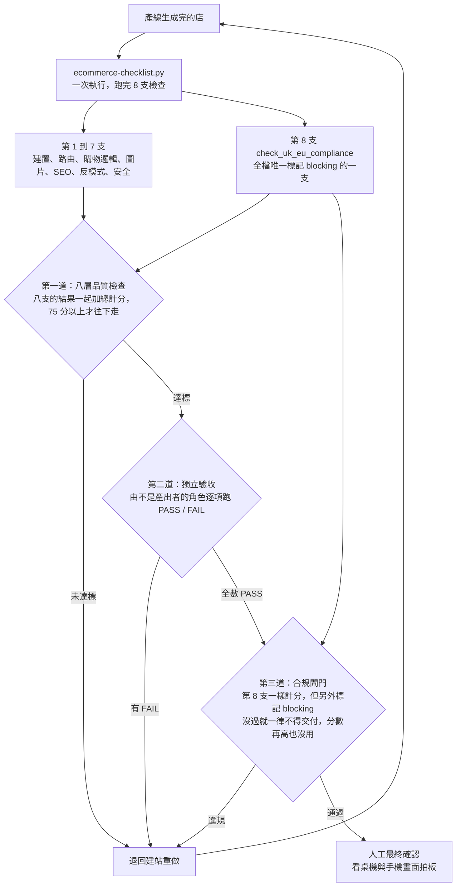

# 一個電商任務怎麼跑完全程

## 流程

```
需求進來
  ↓
市場與客群研究        ← 這個品類有沒有需求、對手在賣什麼、客人在意什麼
  ↓
網站規格書            ← 賣什麼、給誰、要有哪些頁、視覺走什麼方向
  ↓
生產線生成            ← 依規格產出完整店面
  ↓
八層品質檢查          ← 生產線內建，不通過不往下走
  ↓
獨立驗收              ← 由不同的角色跑驗收清單，逐項 PASS/FAIL
  ↓
合規閘門              ← 法規違規是攔截項，分數擋不住它，違規一律退回
  ↓
人工最終確認          ← 看桌機與手機截圖拍板
  ↓
可部署
```

## 每一段在做什麼

### 市場與客群研究
先確認這個品類值不值得做。查需求、查競品在賣什麼價位、查客人真正在意的點。這一段的產出是判斷依據，不是文案。

### 網站規格書
把研究結果變成一份可執行的規格：賣什麼、給誰看、需要哪些頁面、視覺要走什麼調性、有哪些非做不可的元素。

規格書寫清楚了，後面的生成才不會每次都重新猜。

### 生產線生成
依規格產出一個完整的店面：首頁、商品列表、商品詳情、購物車、結帳流程。

生產線內建一組設計模板庫，用來避免每個站長得一樣。**這是這條產線最核心的設計**：AI 生成最容易被看出來的破綻就是版型重複，所以模板庫的存在是為了讓每個站有各自的骨架。

### 商品也不重複

設計不重複只解決了一半。兩個站長得不一樣、賣的東西一模一樣，一樣會被看出是同一批人做的。

所以商品端有一個對應的機制：系統維護一個**商品池**，池子裡的商品照品類分好組。要開一個新站的時候，系統從池子裡挑**一個**還沒用過的品類，這個站就只賣那個品類的東西。挑過的品類會被記下來，不會再被挑到，直到池子裡所有品類都用過一輪才重新開始。

**這代表兩件事。** 一是任何兩個站的商品清單不會重疊。二是**池子換一批，整條產線就能再產出一批全新的、跟過去所有站都不重疊的站**，不用改產線，只要換池子。

目前的池子有 20 個品類、412 個品項，也就是這一池就能撐 20 個彼此不重複的站，已經用掉 3 個。

### 商品照片是 AI 生成的，而且不是免費的

站上的商品照片不是圖庫圖，也不是拍出來的，是每個站自己生成的。這是刻意的：圖庫圖可以被反向圖搜，一搜就露出「這是模板站」的破綻。

生成用的是 Google 的 Stitch。**它有使用額度上限，不是無限也不是免費的。**

| 項目 | 數字 | 依據 |
|---|---|---|
| 免費額度 | 後台顯示 **400** | ⚠️ **未確認**：計算方式與週期（每日或每月）以官方後台為準，我們沒有找到公開的規則說明 |
| 一個站需要幾張 | **28 張**（8 個商品 × 3 張 + 4 張情境圖） | 2026-08-06 實測，見 `examples/` 底下的站 |
| 換算一天能生幾個站 | 約 **14 個** | ⚠️ **推算**：400 ÷ 28。實際會因重生與失敗重試而變少 |

**要更大量生產就得改用按量計價的 API。** 目前的量在免費額度內夠用，但**這一條要先講清楚，避免把「現在看到的照片」理解成零成本**。

同一個站裡的每張照片都不重複，這是硬性規定，交付前用檔案指紋逐張比對，不是用看的。

### 三道檢查怎麼串起來



第八支的偵測程式跟前面七支寫在同一支腳本、同一次執行裡跑完，但**擋交付的判定是分開的**：
八支一起加總成分數，第八支也在分母與分子裡；它另外被標記為 blocking，沒過就一律不得交付，分數再高也沒用。

### 八層品質檢查
生產線內建，不通過就不往下走。檢查的是結構性的問題：破圖、缺價格、連結斷掉、行動版破版、明顯的排版錯誤。

### 獨立驗收
**產出的角色不負責驗收自己的成品。** 由另一個角色拿驗收清單逐項跑 PASS/FAIL，用真實瀏覽器開站截圖，看使用者真正會看到的畫面，不看程式碼寫得漂不漂亮。

清單在 `../quality/acceptance-checklist.md`。

### 合規閘門

**這一道的分數擋不住它。** 法規類的問題一樣折算進總分，但它另外被標記為攔截項：違規一律判定失敗並退回重做，總分再高也沒用。

最容易踩到的是三種：沒有 30 天最低價基準的劃線原價與折扣標籤、編出來的庫存數字、編出來的瀏覽人數。做不到就整條省略，不准編。

規則的來源是實際踩過的坑：曾經有版本把所有檢查折算成分數加總，跑出 87 分判定通過，裡面帶著法規違規。這一道由 [13 法遵與風控](../departments/13-compliance.md) 負責。自動偵測的程式跟前面的品質檢查寫在同一支腳本裡（第八層，也是全檔唯一標記為攔截的一支），但**擋交付的判定是獨立的**：它一樣進分數，只是額外標記為攔截項，沒過就一票否決，總分再高也沒用。

### 人工最終確認
自動化的評分只當初評參考。「這站夠不夠成熟、能不能交付」由人看桌機與手機截圖拍板。

**這一步刻意不自動化。** 品味這件事目前沒有可靠的自動判準，硬做只會讓不夠好的東西過關。

## 為什麼產出與驗收要分開

同一個角色做完又自己驗，等於考生自己改考卷。

分開之後，驗收的標準才會是「這個東西會不會壞」，而不是「我做的東西應該沒問題」。驗收清單裡有一條硬性要求：**驗收要能證明東西會壞，不是證明它沒壞**，所以清單裡包含刻意製造失敗的檢查項。
